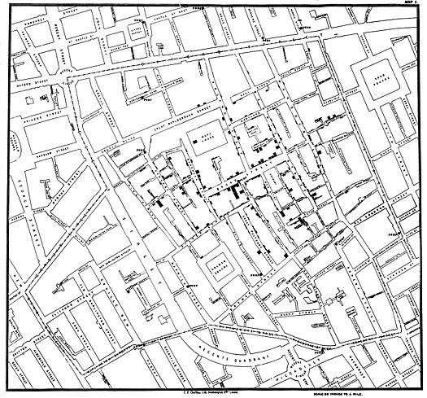
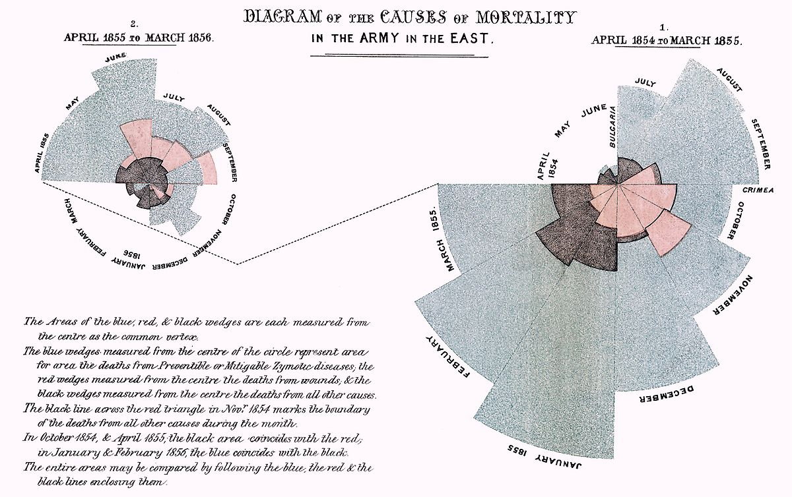
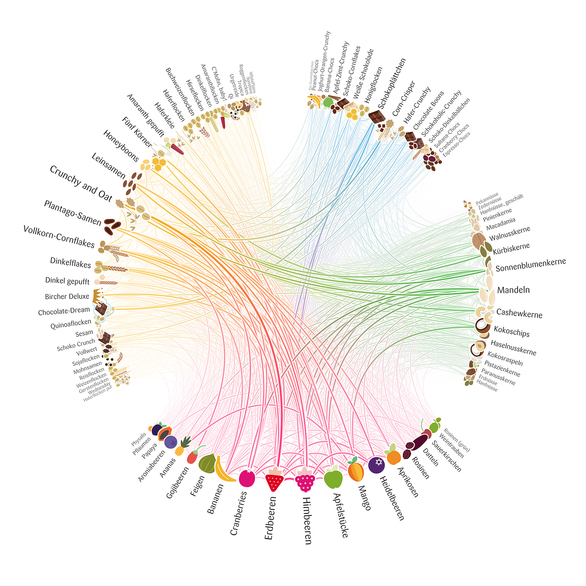
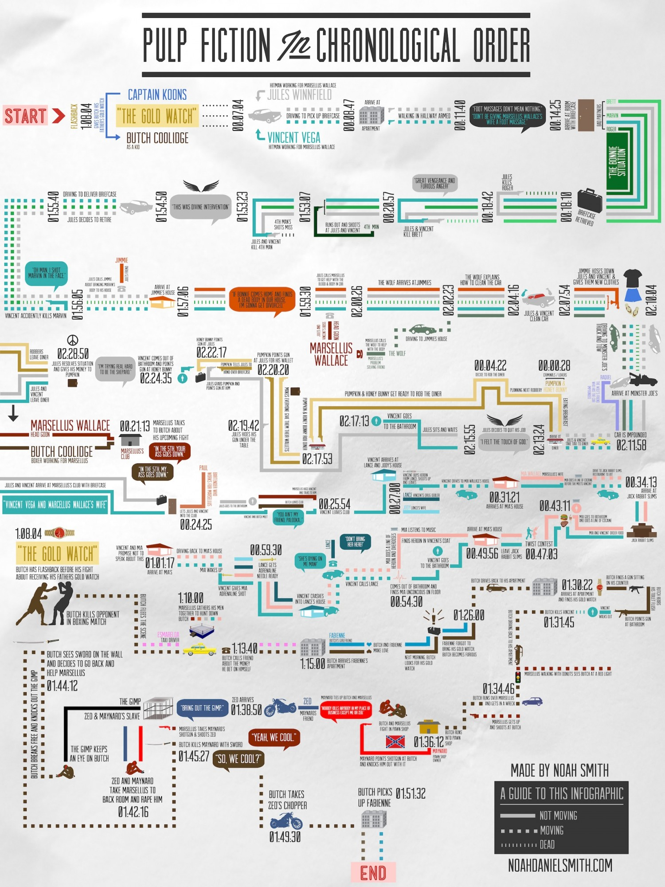
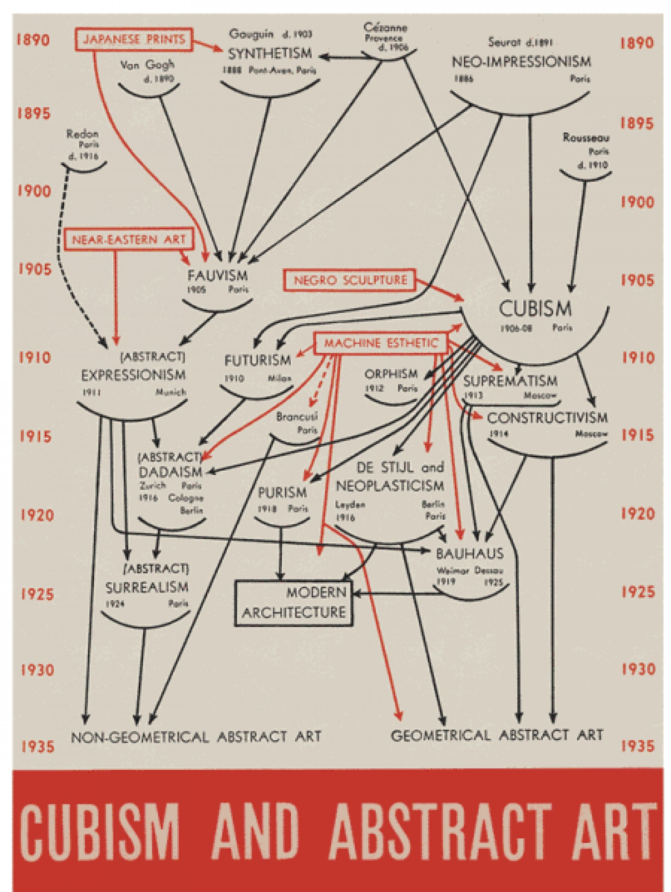
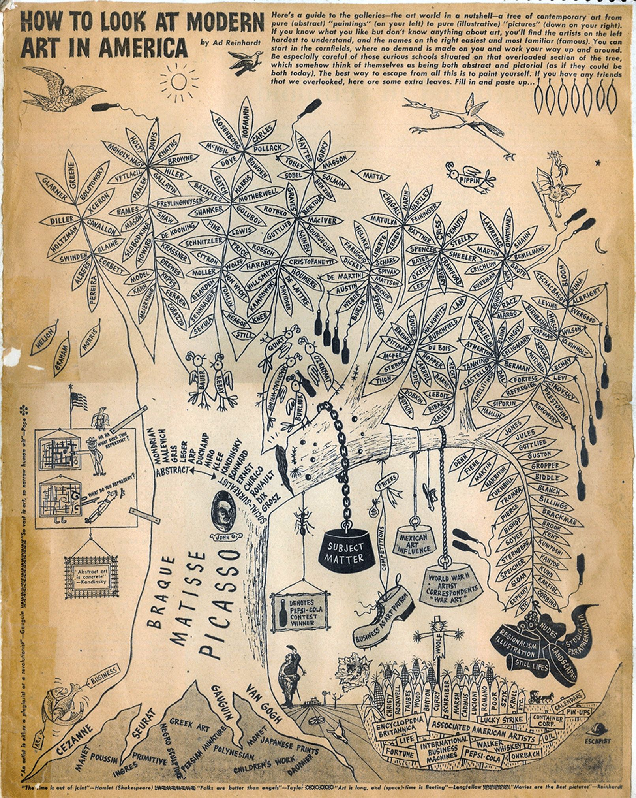
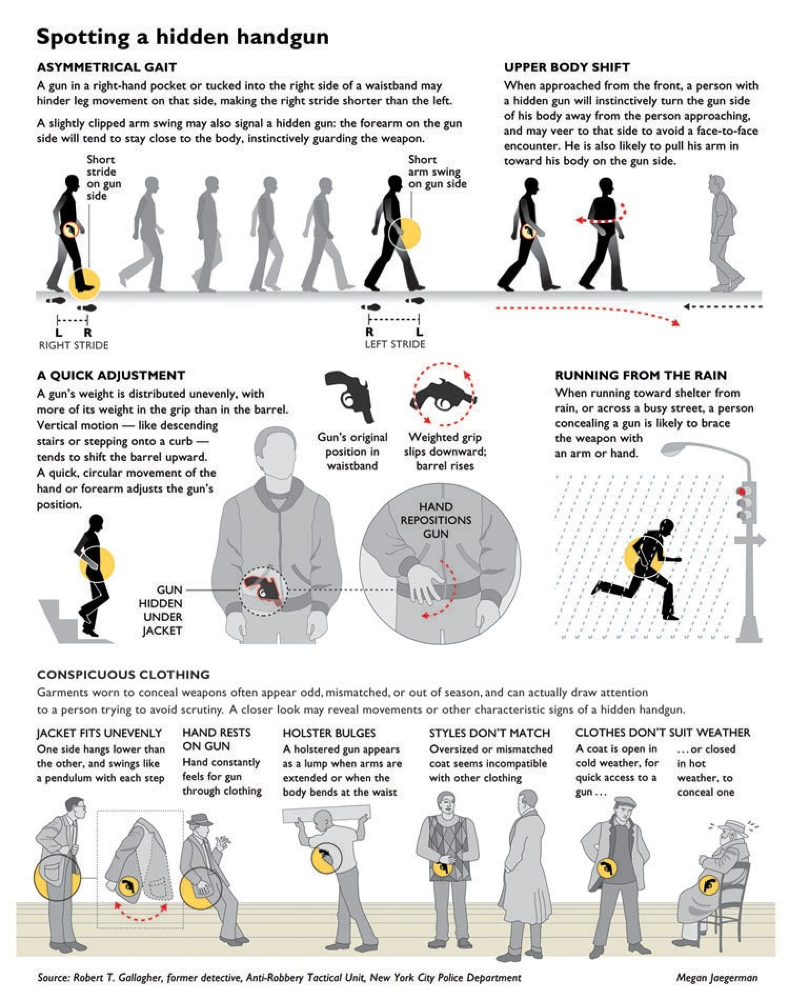

# InfoVisCollection
the use of computer-supported interactive visual representations of abstract data to amplify cognition

[TOC]

# 静态图

1. Snow’s map of cholera epidemic

   

   source:https://en.wikipedia.org/wiki/1854_Broad_Street_cholera_outbreak

2. Minard’s diagram of Napoleon’s campaign against Russia

   

   source:https://en.wikipedia.org/wiki/File:Minard.png

3. Nightingale’s rose of Crimean War causalities

   

   source:https://commons.wikimedia.org/wiki/File:Nightingale-mortality.jpg

4. Static representations can have exploratory facets by providing a large enough amount of complex information that can be explored from different angles

   

   source:http://truth-and-beauty.net/projects/muesli-ingredient-network

5. Iraq's bloody toll：The visual encoding in this graphic suggests a clear interpretation of the data that fits with the author’s narrative.

    source：https://www.scmp.com/infographics/article/1284683/iraqs-bloody-toll

6. Education vs. Incarceration:Using Philadelphia as an example, this graphic compares the cost, both financial and societal, of education and incarceration. Designed by Jason Killinger for Maskar Design

   

   source:https://visual.ly/community/infographic/education/education-vs-incarceration

7. Pulp Fiction in Chronological Order

   

   source:https://visual.ly/community/Infographics/entertainment/pulp-fiction-chronological-order

8. Comprehensive History of Philosophy

   source：https://superscholar.org/comp-history-philosophy/

9. Cubism and abstract art：

   

   source：https://visual.ly/community/Infographics/other/cubism-and-abstract-art

10. how to look at modern art in america:

    

    source:https://www.pinterest.com/pin/137782069826585528/

11. spotting a hidden gun :

    

    source:https://visual.ly/community/Infographics/how/how-spot-hidden-handgun

# 网页

1. a colloection：https://www.cc.gatech.edu/gvu/ii/dds/charts/corpus.html

2. Film Dialogue ： https://pudding.cool/2017/03/film-dialogue/index.html

   (a) “Film Dialogue” is a narrative comparing female to male dialogue in 2000 screenplays of popular films. 

   (b) When scrolling through the explanatory text, animated transitions link each view to the next. 

   (c) The story’s main message that women have far less dialogue than men is clearly communicated by the views and the accompanying text. Yet, the reader can explore each view interactively to investigate individual films. Thus, explanation and exploration complement one another to form an engaging story.

3. https://www.theguardian.com/world/ng-interactive/2015/aug/26/china-economic-slowdown-world-imports

   This interactive data-driven story contains explanatory elements, such as the headline, text, tooltips, and visual metaphor. It also contains exploratory elements: a reader can explore the effect of different values of China’s economic slowdown by sliding the bottom circle, representing China, up or down. This updates the visualization of the remaining countries accordingly.

4. http://mbtaviz.github.io/

   This graphic juxtaposes a subway map, heatmaps, bars, and text to provide a flexibility in the view. It further supports flexibility of focus by using a variety of small graphics that reveal different aspects of the data.

5. https://terror.periscopic.com/

   The multiple coordinated views shown here allow the reader to explore connections through brushing and linking.

6. http://www.facesoffracking.org/data-visualization/

   Readers can experience this visualization in different sequences by stepping through different points on the right or by scrolling to step through in an author-determined linear order. 

7. https://www.bloomberg.com/graphics/2015-whats-warming-the-world/

   This data-driven story uses a linear sequence of visualizations to build a narrative. 

   (a) Data is sequentially revealed to create suspense and support the message. First, two uncorrelated data time series are compared. 

   (b) In the last step of the sequence, the author has placed all previously shown data within one view to support the story’s conclusion.

8. https://www.nytimes.com/interactive/2015/03/19/upshot/3d-yield-curve-economic-growth.html

9. https://www.nytimes.com/interactive/2014/08/13/upshot/where-people-in-each-state-were-born.html

10. https://infogram.com/beyond_crowdfunding

11. https://www.nytimes.com/interactive/2015/01/29/sunday-review/road-map-home-values-street-names.html

12. https://www.nytimes.com/interactive/2014/09/03/us/the-race-gap-in-americas-police-departments.html

13. https://www.nytimes.com/interactive/2014/07/31/world/middleeast/in-gaza-a-pattern-of-conflict.html

14. https://www.nytimes.com/interactive/2014/09/19/nyregion/stop-and-frisk-is-all-but-gone-from-new-york.html

15. https://www.nytimes.com/2014/09/05/upshot/4th-down-when-to-go-for-it-and-why.html

16. https://www.nytimes.com/interactive/2014/09/14/sports/baseball/jeter-swings.html

17. https://www.theguardian.com/film/ng-interactive/2015/feb/20/what-it-really-means-to-win-the-oscars-best-director

18. https://www.theguardian.com/world/interactive/2012/may/08/gay-rights-united-states

19. The History and Future of Everything—Time:https://www.youtube.com/watch?v=2XkV6IpV2Y0

20. https://www.bloomberg.com/graphics/dataview/how-americans-die/

21. https://www.bloomberg.com/graphics/dataview/bubble-to-bust-to-recovery/

    This demonstrates the use of dots as breadcrumbs, highlighting elements, tooltips, and a consistent color scheme between the textual narrative and the visualization. The legend acts as a dynamic query widget for filtering the chart

22. http://muyueh.com/greenhoney/

23. http://selfiecity.net/

24. https://www.bbc.com/future/article/20150318-i-use-a-drone-to-spy-on-people

25. https://www.bloomberg.com/graphics/2015-auto-sales/

    These consist of the single set of glyphs repositioned into different groups when the reader scrolls to a certain position.

26. Wealth Inequality in America:https://www.youtube.com/watch?v=QPKKQnijnsM

27. https://www.nytimes.com/interactive/2014/10/29/upshot/obamacare-who-was-helped-most.html

28. https://qz.com/296941/interactive-graphic-every-active-satellite-orbiting-earth/

29. http://www.thewaterweeat.com/

30. http://globe.cid.harvard.edu/

31. The Fallen of World War II：https://vimeo.com/128373915

32. US debt ceiling visualized in $100 bills：http://demonocracy.info/infographics/usa/us_debt/us_debt.html

33. Hans Rosling’s 200 countries, 200 years, 4 minutes—The joy of stats— BBC Four：https://www.youtube.com/watch?v=jbkSRLYSojo

34. U.S. gun deaths in 2013：https://guns.periscopic.com/?year=2013

35. https://www.oecdbetterlifeindex.org/#/34111111111

36. https://www.nytimes.com/interactive/2015/05/28/upshot/you-draw-it-how-family-income-affects-childrens-college-chances.html?mtrref=undefined&gwh=A6EBCBFDFCAE9877FDF615A9027822AA&gwt=pay&assetType=PAYWALL

37. https://www.nytimes.com/interactive/2014/02/09/opinion/minimum-wage.html

38. http://paintbynumbersblog.blogspot.com/2014/07/minimum-wage-story-points-edition.html

    This scene provides examples of textual narrative, slides with titles as breadcrumbs, element highlighting, and textual annotation on the chart.

39. https://www.washingtonpost.com/graphics/national/police-shootings-2016/

40. https://unwanted.interactivethings.io/#/introduction

41. https://www.wsj.com/graphics/beat-the-fed/

42. https://www.ons.gov.uk/peoplepopulationandcommunity/birthsdeathsandmarriages/conceptionandfertilityrates/articles/teenagepregnanciesperceptionversusreality/2016-03-09

43. 汉密尔顿 https://pudding.cool/2017/03/hamilton/index.html

44. 汉密尔顿韵律 http://graphics.wsj.com/hamilton/

45. 古典音乐可视化 https://mymodernmet.com/classical-music-data-visualizations-nicholas-rougeux/

46. https://en.99designs.jp/blog/design-other/sound-visualization-design-inspiration/

47. 

# Useful websites

1. Narrative Patterns for Data-Driven Storytelling http://napa-cards.net/
2. http://www.datasketch.es/
3. http://www.dear-data.com/theproject/
4. http://dear-data-two.com/
5. a section of FlowingData excellent blog specifically on data art https://flowingdata.com/category/visualization/artistic-visualization/
6. a TEDx playlist (take it with skepticism) https://www.ted.com/playlists/201/art_from_data
7. a very interesting REDDIT thread https://www.reddit.com/r/DataArt/
8. a link to discuss briefly about the concept of "data art" more news about this https://www.theatlantic.com/entertainment/archive/2015/05/the-rise-of-the-data-artist/392399/

# Todos

1. 疫情相关的可视化